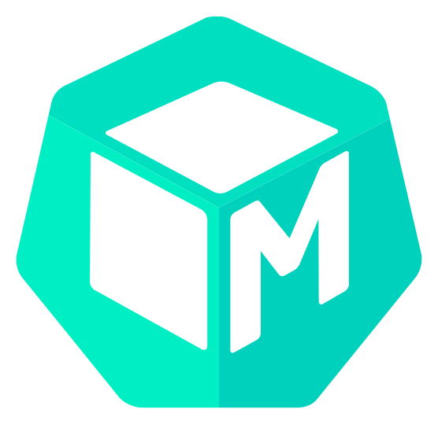
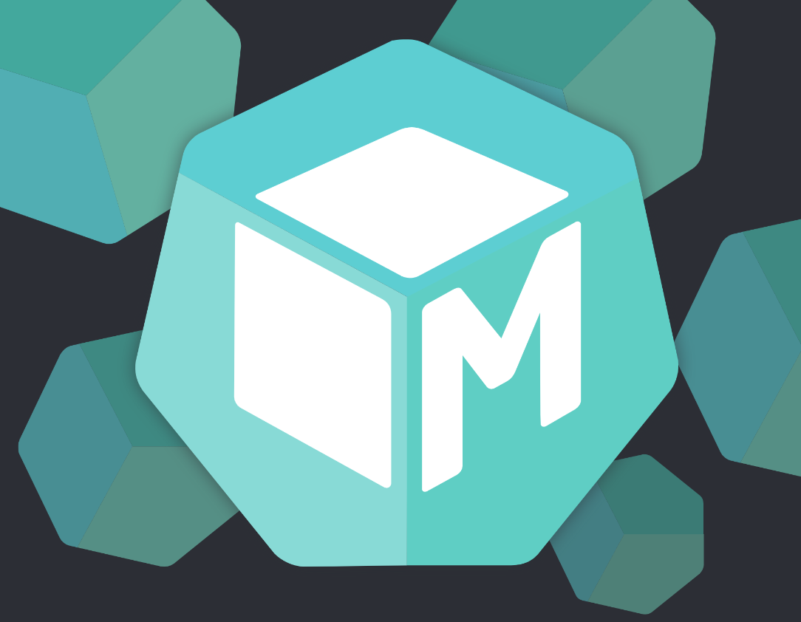
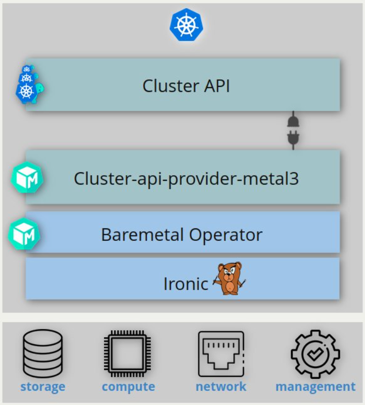
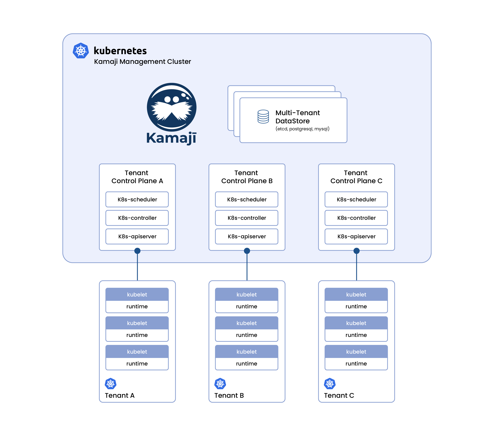
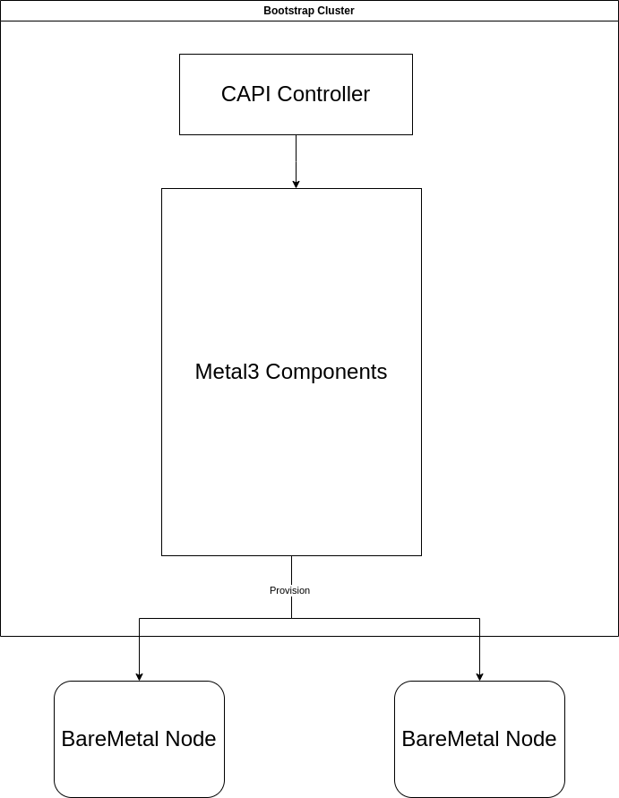
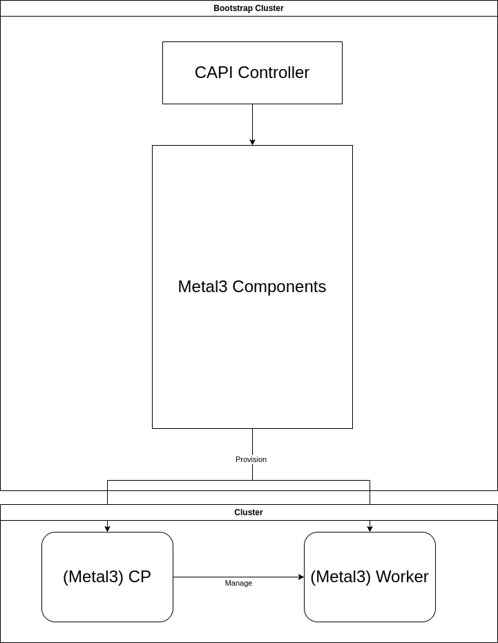
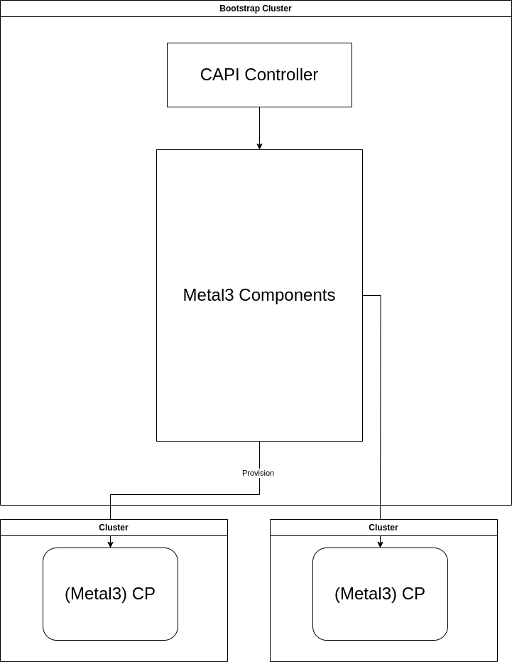
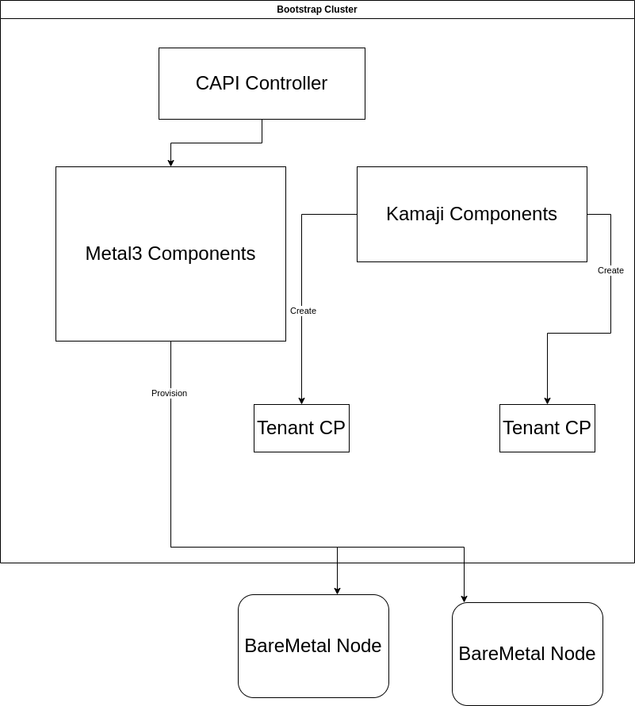
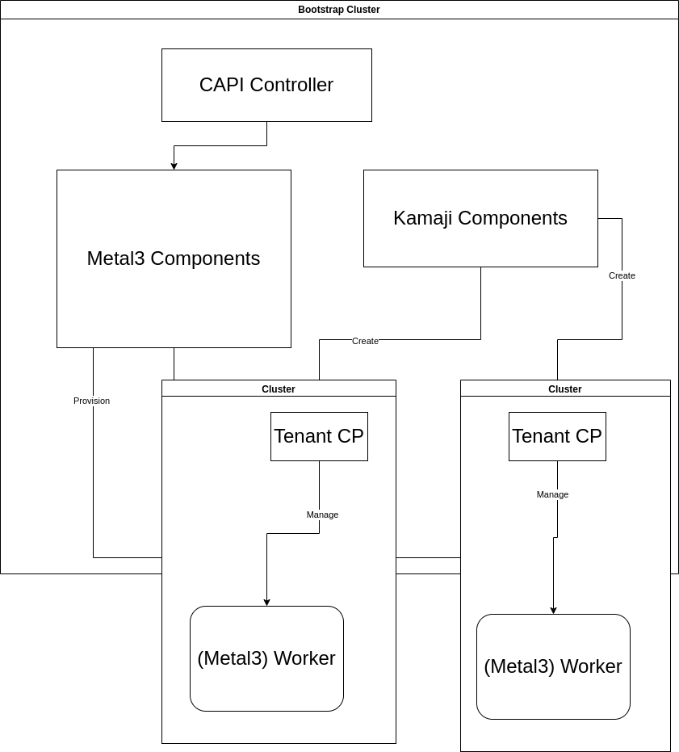
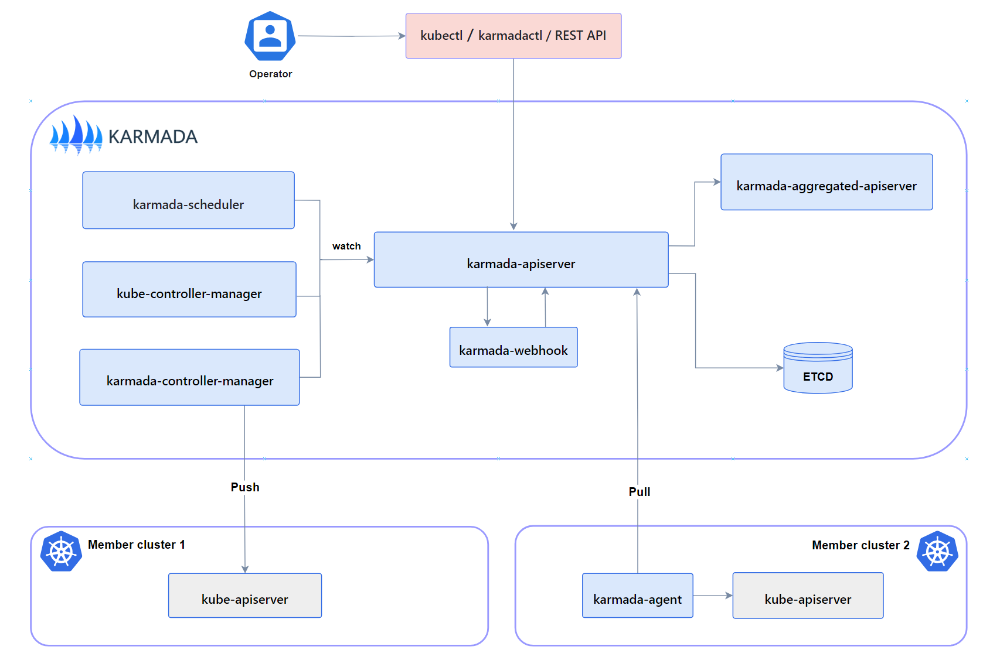

<!-- .slide: class="l-cover" -->
# Baremetal k8s provision with Metal3 using Kamaji Control Plane provider

<div id="logos">



</div>
---
## About Metal3
<!-- .slide: data-background-color="#00E0C1" -->
<div class="left">


</div>
<div class="right">

- Metal3 is a project that handles Baremetal provisioning on Kubernetes
<!-- .element: class="fragment" -->
- It has a Cluster API provider that can provision baremetal hosts as kubernetes cluster
<!-- .element: class="fragment" -->
- In a typical Metal3-provisioned cluster, both CP and worker nodes are baremetal 
<!-- .element: class="fragment" -->

https://metal3.io 
<!-- .element: class="fragment" -->
</div>
---
## Metal3 Components
<!-- .slide: data-background-color="#00E0C1" -->


Note: Here is an image of Metal3's main components. We have one Cluster API infra provider, CAPM3, and one Operator call Baremetal Operator.
Ironic is the entity doing the low-level management of the baremetal nodes
---
## About Kamaji
<!-- .slide: data-background-color="#224472" -->
Kamaji is a Kubernetes Control Plane (CP) Manager. It manages K8s CP as "Tenant Control Plane" pods.
<!-- .element: class="fragment" -->
https://kamaji.clastix.io/
<!-- .element: class="fragment" -->
---
## About Kamaji
<!-- .slide: data-background-color="#224472" -->

---
## About Kamaji
<!-- .slide: data-background-color="#224472" -->

---
<!-- .slide: class="l-cover" -->
# Why does it matter though?
## i.e. Why to use Kamaji with Baremetal? <!-- .element: class="fragment" -->
---
## Typical Metal3-provisioned clusters

----
## Typical Metal3-provisioned clusters

---
## An alternative layout

---
## Metal3-provisioned clusters with Kamaji CPs

----
## Metal3-provisioned clusters with Kamaji CPs

Note: Kamaji also provides other fine-tuning features that make resource saving even more efficient, for example, shared etcd.
---
<!-- .slide: class="l-cover" -->
# But doesn't having many clusters make management harder?
#### Should we just have bigger clusters with real CP machines?
Note: This is totally a valid concern, since managing multiple clusters is difficult. CAPI allows you to provision and manage the clusters life cycles from a central management cluser, but it does not help application level LCM on the member clusters. So, if having big, normal cluster with multiple workers works for you, then it's great. However, let's consider an example usecase.
---
# Problem
- Multiple Baremetal hosts
<!-- .element: class="fragment" -->
- Various locations, sizes and latencies
<!-- .element: class="fragment" -->
# Requirements
- Centralized management
<!-- .element: class="fragment" -->
- Application resiliency
<!-- .element: class="fragment" -->

_Application resiliency includes the worker node's ability to continue its assigned tasks even if its connection towards the CP is broken._
<!-- .element: class="fragment" -->
---
# Options
1. Normal kubernetes cluster
<!-- .element: class="fragment fade-in-then-semi-out" -->
1. Remote clusters
<!-- .element: class="fragment fade-in-then-semi-out" -->
---
## Normal kubernetes cluster
Centralized management <span> &#x2714; </span> <!-- .element: class="fragment fade-in" -->
Application Resiliency <span> &#x2717; </span> <!-- .element: class="fragment fade-in" -->
Note: By default, Kubernetes has a healing mechanism to set all of a worker node's pods to "Deletion" once that worker node is not accessible, and reassign those pods to other worker nodes. When the connection to the lost worker is reestablished, all of those pods will be killed. This behavior is sometimes not desired, especially in edge networks scenarios.
---
## Remote clusters

Centralized management <span> &#x2717; </span> <!-- .element: class="fragment fade-in" -->
Application Resiliency <span> &#x2714; </span> <!-- .element: class="fragment fade-in" -->
Note: So the "morale" of this example is to show you that there are certain situations in which having multiple clusters is desired. But managing application level LC on many clusters at once might be a big challenge.
---
## Metal3 with Kamaji Setup
- Only provision worker node with Metal3
- Use `metallb` as a load-balancer to provide ip to Kamaji CP.
- Provide the same IP to `Metal3Cluster`.
Note: The exact setup did, of course, require some investigation, but in the end it was pretty straight-forward.
In a typical Metal3 cluster provision, Metal3 has its own ip provider that handles the ip allocation. That ipam doesn't work with kamaji, unfortunately, as kamaji expects a loadBalancer.
---
## Metal3 with Kamaji Setup
```yaml [6,20,32]
apiVersion: controlplane.cluster.x-k8s.io/v1alpha1
kind: KamajiControlPlane
metadata:
  name: {{ .Values.cluster.name }}
  annotations:
    metallb.universe.tf/loadBalancerIPs: {{ .Values.serviceAddress }}
spec:
  dataStoreName: default
  kubelet:
    cgroupfs: systemd
    preferredAddressTypes:
      - ExternalIP
      - InternalIP
      - Hostname
  addons:
    coreDNS: { }
    kubeProxy: { }
  network:
    serviceType: LoadBalancer
    serviceAddress: {{ .Values.serviceAddress }}
  deployment:
  replicas: 2
  version: 1.28.5
apiVersion: infrastructure.cluster.x-k8s.io/v1beta1
--
kind: Metal3Cluster
metadata:
  name: {{ .Values.cluster.name }}
  namespace: default
spec:
  controlPlaneEndpoint:
    host: {{ .Values.serviceAddress }}
    port: 6443
  noCloudProvider: true
```
---
# Demo: Provision Metal3 baremetal clusters with Kamaji control planes
---
<iframe data-src="https://asciinema.org/a/643322/iframe?" id="asciicast-iframe-643322" name="asciicast-iframe-gJMGgx3h2YCYBl1tjpTGRX3Cq" scrolling="yes" allowfullscreen="true" style="overflow: hidden; margin: 0px; border: 0px; display: inline-block; width: 100%; float: none; visibility: visible; height: 1200px;"></iframe>
---
## Multi-Cluster Management (MCM)
- MCM is the idea of having multiple clusters managed centrally from one management cluster.
<!-- .element: class="fragment" -->
- There is a sig-group called Multi-cluster sigs, which standardize and co-ordinate different practices around multi-cluster
<!-- .element: class="fragment" -->
- There are at least a dozen of opensourced projects that handle MCM
<!-- .element: class="fragment" -->
---
## MCM Push and Pull modes

<!-- .element: class="fragment" -->
Note: This is a diagram taken from documentation of Karmada, currently one of the most popular MCM projects. We're about to see Karmada in action in the demo soon, but for now what I'd like to show is the two modes that the management cluster can used to access to a member cluster.
----
## MCM Push and Pull modes
<div class="left">

### Push mode
#### Pros:
- Save Resources (on member cluster)

#### Cons:
- Require stable access to member clusters' API
</div>
<div class="right">

### Pull mode
#### Pros:
- Allows intermittent connection from manager cluster to member clusters

#### Cons:
- Consumes more resources

</div>
---
## MCM Push and Pull modes

- The differences between push mode and pull mode is a trade-off between less resource consumed and more reliable management. 
<!-- .element: class="fragment" -->
- Kamaji-hosted CPs allow all CPs in one place, which means we can use push mode instead pull mode
<!-- .element: class="fragment" -->
---
# Demo: Karmada management on Metal3+Kamaji-provisioned clusters
---
<iframe data-src="https://asciinema.org/a/643323/iframe?" id="asciicast-iframe-643323" name="asciicast-iframe-gJMGgx3h2YCYBl1tjpTGRX3Cq" scrolling="yes" allowfullscreen="true" style="overflow: hidden; margin: 0px; border: 0px; display: inline-block; width: 100%; float: none; visibility: visible; height: 1200px;"></iframe>
